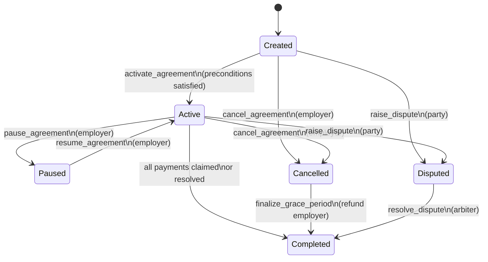
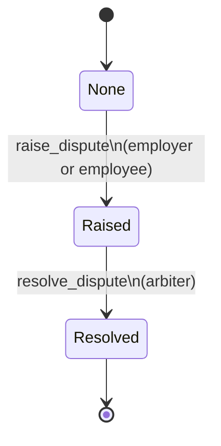
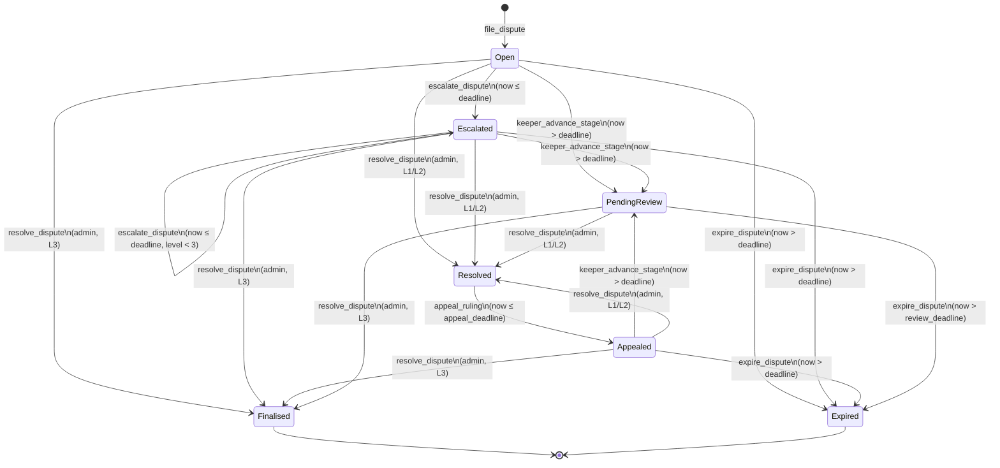

## Agreement State Machines

This document provides a high-level, implementation-aligned view of the main state machines in the payroll contract, focusing on **agreement lifecycle**, **disputes**, and **grace-period cancellation**.

It is intentionally minimal, but accurate enough to guide reviews, audits, and integration work.

---

### Core Agreement Lifecycle

On-chain type: `AgreementStatus` (see `onchain/contracts/stello_pay_contract/src/storage.rs`).

States:

- `Created`: agreement exists but is not yet activated
- `Active`: agreement is live, and payments/claims are allowed
- `Paused`: agreement temporarily suspended
- `Cancelled`: employer has cancelled; grace-period refund flow applies
- `Completed`: agreement fully settled (all funds distributed or refunded)
- `Disputed`: a dispute has been raised and must be resolved

#### State Diagram



#### Main Transitions and Conditions

- **`Created → Active`**
  - Trigger: `activate_agreement`
  - Conditions:
    - Agreement exists
    - For payroll mode: at least one employee added
    - Caller is employer
  - Effects:
    - `status = Active`
    - `activated_at` set to current ledger timestamp

- **`Active ↔ Paused`**
  - `Active → Paused`
    - Trigger: `pause_agreement`
    - Conditions: caller is employer; status is `Active`
    - Effects: `status = Paused`
  - `Paused → Active`
    - Trigger: `resume_agreement`
    - Conditions: caller is employer; status is `Paused`
    - Effects: `status = Active`

- **`Created/Active → Cancelled`**
  - Trigger: `cancel_agreement`
  - Conditions:
    - Caller is employer
    - Status is `Created` or `Active`
  - Effects:
    - `status = Cancelled`
    - `cancelled_at` set to current timestamp
    - Grace period window becomes active (`grace_period_seconds`)

- **`Cancelled → Completed`**
  - Trigger: `finalize_grace_period`
  - Conditions:
    - Status is `Cancelled`
    - Grace period has fully elapsed
  - Effects:
    - Remaining escrow refunded to employer
    - Agreement marked logically complete (no further claims expected)

- **`Active → Completed`**
  - Trigger: last payment / last milestone claim / dispute resolution
  - Conditions:
    - All funds have been distributed according to the agreement
  - Effects:
    - `status = Completed`

---

### Dispute Lifecycle (Payroll Contract — Simple Path)

On-chain type: `DisputeStatus` and the `dispute_status` field on `Agreement`.

States:

- `None`: default, no active dispute
- `Raised`: dispute opened by employer or employee
- `Resolved`: dispute resolved by arbiter

#### State Diagram



#### Transitions and Conditions

- **`None → Raised`**
  - Trigger: `raise_dispute`
  - Conditions:
    - Caller is employer or participant in the agreement
    - No existing active dispute
  - Effects:
    - `dispute_status = Raised`
    - `DisputeStatus` storage updated; `dispute_raised_at` set

- **`Raised → Resolved`**
  - Trigger: `resolve_dispute`
  - Conditions:
    - Caller is configured arbiter
    - Payout split (`pay_employee`, `refund_employer`) does not exceed total locked funds
  - Effects:
    - Funds distributed according to arbiter decision
    - `dispute_status = Resolved`
    - Agreement typically transitions to `Completed`

Error states (see `PayrollError`):

- `DisputeAlreadyRaised`, `NotParty`, `NotArbiter`, `InvalidPayout`, `ActiveDispute`, `NoDispute`
- These correspond to:
  - double-raise attempts
  - unauthorized callers
  - over-allocating beyond total locked amount
  - conflicting lifecycle (e.g., trying to finalize while dispute is active)

---

### Dispute Escalation Contract State Machine

On-chain type: `DisputeStatus` in `onchain/contracts/dispute_escalation`.

This is the full three-tier escalation state machine with per-level SLA timers,
a keeper-triggered `PendingReview` stage, and binding outcome records.

#### States

| State | Terminal? | Description |
|-------|-----------|-------------|
| `Open` | No | Dispute filed at Level1; SLA clock running |
| `Escalated` | No | Moved to next tier; fresh SLA clock running |
| `Appealed` | No | Level1/2 ruling appealed; fresh SLA at next level |
| `PendingReview` | No | SLA elapsed; keeper advanced stage; admin review window open |
| `Resolved` | No | Admin ruled at Level1/2; 3-day appeal window open |
| `Finalised` | **Yes** | Admin ruled at Level3; binding, no further appeal |
| `Expired` | **Yes** | Phase deadline passed with no admin action; closed without ruling |

#### State Diagram



#### SLA Timer Design

Every phase is governed by a **deterministic ledger timestamp** stored in
`DisputeDetails.phase_deadline`, computed from `env.ledger().timestamp()`:

```text
file_dispute         →  phase_deadline = now + level_time_limit(Level1)   [default 7 days]
escalate_dispute     →  phase_deadline = now + level_time_limit(next_level)
resolve_dispute      →  phase_deadline = now + 259_200 (3-day appeal window) [L1/L2 only]
appeal_ruling        →  phase_deadline = now + level_time_limit(next_level)
keeper_advance_stage →  phase_deadline = now + pending_review_time_limit   [default 3 days]
```

Boundary semantics — `now == deadline` is still **within** the window:

| Action | Passes when | Blocked when |
|--------|-------------|--------------|
| `escalate_dispute` | `now ≤ deadline` | `now > deadline` → `TimeLimitExpired` |
| `expire_dispute` | `now > deadline` | `now ≤ deadline` → `DeadlineNotPassed` |
| `keeper_advance_stage` | `now > deadline` | `now ≤ deadline` → `DeadlineNotPassed` |
| `appeal_ruling` | `now ≤ appeal_deadline` | `now > appeal_deadline` → `TimeLimitExpired` |

#### `PendingReview` — Keeper-Triggered SLA Enforcement

`keeper_advance_stage` is **permissionless**: any address may call it once
the current `phase_deadline` has elapsed.  Security invariants:

1. **No stage skipping** — transitions only to `PendingReview`, never directly
   to `Resolved` or `Finalised`.
2. **Idempotent-safe** — a second call returns `AlreadyPendingReview`;
   no duplicate event is emitted.
3. **Level preserved** — `level` and `outcome` are not mutated.
4. **No outcome authority** — only the admin can write a binding ruling.

#### Transitions Detail

- **`(none) → Open`**
  - Trigger: `file_dispute(caller, agreement_id)`
  - Conditions: no existing dispute for `agreement_id`
  - Effects: `status = Open`, `level = Level1`, `phase_deadline = now + L1_limit`

- **`Open/Escalated → Escalated`**
  - Trigger: `escalate_dispute(caller, agreement_id)`
  - Conditions: not terminal, not resolved, `now ≤ phase_deadline`
  - Effects: `level++`, `status = Escalated`, fresh SLA window for new level

- **`Open/Escalated/Appealed → PendingReview`**
  - Trigger: `keeper_advance_stage(caller, agreement_id)` (permissionless)
  - Conditions: not terminal, not resolved, not already `PendingReview`, `now > phase_deadline`
  - Effects: `status = PendingReview`, `phase_started_at = now`, `phase_deadline = now + review_limit`
  - Emits: `dispute_sla_breached` event with `breached_at` and `review_deadline`

- **`Open/Escalated/Appealed/PendingReview → Resolved` (L1/L2)**
  - Trigger: `resolve_dispute(admin, agreement_id, outcome)` — **admin only**
  - Conditions: not terminal, not already resolved, `outcome ≠ Unset`
  - Effects: `status = Resolved`, `outcome` written, 3-day appeal window set

- **`Open/Escalated/Appealed/PendingReview → Finalised` (L3)**
  - Trigger: `resolve_dispute(admin, agreement_id, outcome)` — **admin only**
  - Conditions: `level == Level3`, not terminal, not resolved, `outcome ≠ Unset`
  - Effects: `status = Finalised`, `outcome` written — **terminal, no appeal**

- **`Resolved → Appealed`**
  - Trigger: `appeal_ruling(caller, agreement_id)`
  - Conditions: `status == Resolved`, `now ≤ phase_deadline`, `level < Level3`
  - Effects: `level++`, `status = Appealed`, `outcome = Unset` (re-review), fresh SLA

- **`Open/Escalated/Appealed/PendingReview → Expired`**
  - Trigger: `expire_dispute(caller, agreement_id)` (permissionless)
  - Conditions: not terminal, not resolved, `now > phase_deadline`
  - Effects: `status = Expired` — **terminal**
  - Emits: `dispute_expired` event (downstream escrow releases funds to payer)

#### Error States

| Error | Code | When |
|-------|------|------|
| `Unauthorized` | 1 | Non-admin calls `resolve_dispute` or configuration functions |
| `DisputeNotFound` | 2 | `agreement_id` has no dispute |
| `AlreadyResolved` | 3 | Double-resolve attempt; keeper/expire on resolved dispute |
| `MaxEscalationReached` | 4 | `escalate_dispute` or `appeal_ruling` at Level3 |
| `TimeLimitExpired` | 5 | SLA/appeal window elapsed; action no longer valid |
| `InvalidTransition` | 6 | Illegal state change (escalate from `PendingReview`, appeal non-resolved, `Unset` outcome) |
| `NotParty` | 7 | Reserved |
| `AlreadyFinalised` | 8 | Any action on a `Finalised` dispute |
| `DeadlineNotPassed` | 9 | Early expire or keeper call before deadline |
| `AlreadyTerminal` | 10 | Any action on an `Expired` dispute |
| `AlreadyPendingReview` | 11 | `keeper_advance_stage` called twice on same dispute |

---

### Grace-Period and Cancellation Flow

The grace-period flow ties cancellation and finalization together.

High-level:

1. **Employer cancels** an `Active` or `Created` agreement:
   - status becomes `Cancelled`
   - `cancelled_at` set
2. **Grace period** (`grace_period_seconds`) begins:
   - Claims may still be allowed during this window
   - Refunds are blocked until the window has expired
3. **Finalization**:
   - After the grace period, employer calls `finalize_grace_period`
   - Remaining escrow is refunded and the agreement is effectively completed

This flow is validated in the `test_grace_period.rs` suite and underpins all time-based termination behavior for agreements.

