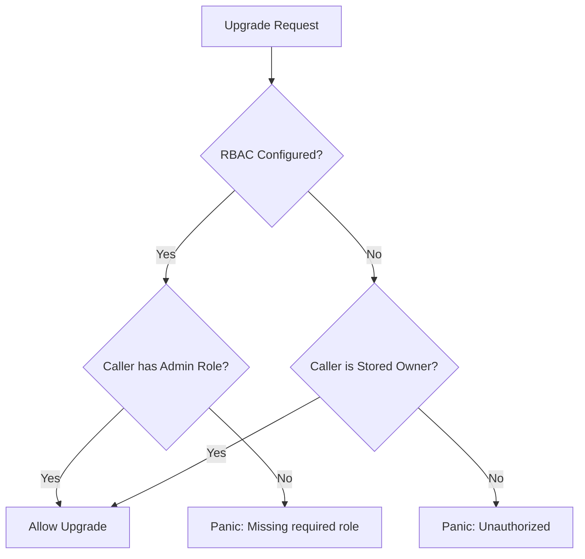

# Contract Upgrade Entrypoint & Security Assertions

The contract upgrade entrypoint (`upgrade`) in the `stello_pay_contract` package is one of the most critical administrative functions in the entire on-chain payroll system. Because unauthorized or malicious updates can permanently compromise or drain contract funds, it is guarded by robust access control checks and verified by property-based and unit test suites.

## 🔐 Access Control Matrix

The upgrade logic implements a multi-tier safety gate to ensure that only authorized administrators can update the contract's WASM bytecode.

### 1. Fallback Mode (RBAC Unset)
- When no external Role-Based Access Control (RBAC) contract is linked:
  - The caller must be the stored `Owner` address initialized during contract deployment.
  - The caller must authenticate via explicit cryptographic signature checking (`require_auth()`).

### 2. Enterprise Mode (RBAC Configured)
- When an external RBAC contract is linked via `set_rbac_contract`:
  - Access control transitions fully to the RBAC contract.
  - The caller must possess the `Role::Admin` role inside the RBAC contract.
  - The caller must authenticate via explicit cryptographic signature checking (`require_auth()`).

---

## 🛡️ Security Assumptions & Threat Model

> [!IMPORTANT]
> A single failure in the upgrade authorization logic is a critical vulnerability. Our security model assumes the following invariants must hold at all times:

1. **Gate Exclusivity**: No combination of non-admin roles (e.g. `Role::Employer`, `Role::Employee`) can ever trigger a successful upgrade.
2. **Signature Binding**: An upgrade call cannot be spoofed; the operator address passed to `upgrade` must match the cryptographic signature sender.
3. **Storage Invariance**: Upgrading the bytecode must preserve all existing storage key layouts (agreements, user periods, backup parameters) without modification or corruption.

---

## 🧪 Testing Strategy

To eliminate regression risks, we employ a hybrid test suite in `tests/upgrade_tests.rs`:

### Unit Tests
- **Owner Upgrade Success**: Ensures the owner can upgrade bytecode when RBAC is not configured.
- **Intruder Upgrade Rejection**: Asserts that random callers are rejected when RBAC is unset.
- **RBAC Admin Upgrade Success**: Verifies that granted Admins can upgrade the bytecode when RBAC is active.
- **RBAC Non-Admin Rejection**: Asserts that operators with lesser roles (e.g., `Employer`) are blocked.

### Property-Based Tests (`proptest`)
Using property-based testing allows us to verify the gate holds under a infinite space of inputs:
- **`prop_non_owner_upgrade_always_fails`**: Proves that for any generated non-owner address and any arbitrary 32-byte hash, the access control gate blocks the call.
- **`prop_non_admin_rbac_upgrade_always_fails`**: Proves that any non-admin role configuration always fails under all arbitrary inputs.
- **`prop_admin_upgrade_preserves_invariants`**: Proves that executing a valid admin upgrade retains agreement information, balances, and configurations across the upgrade boundary.
